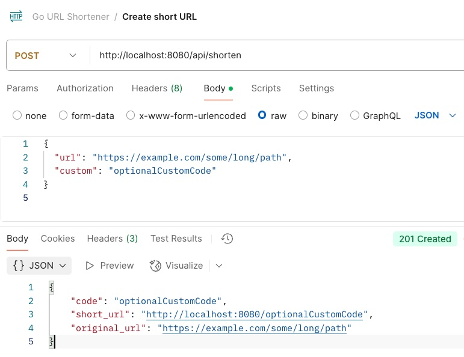
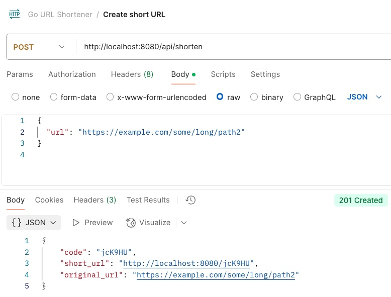
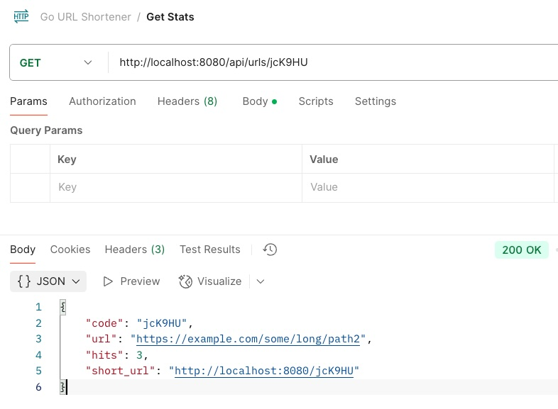

# go-url-shortener

A minimal, production-friendly URL shortener in Go with persistent storage (BoltDB) and a tiny Docker image.

## Features
- REST API to create short links
- Redirect endpoint (`/{code}`)
- Stats endpoint (hits per code)
- BoltDB persistence (no external DB)
- Multi-stage Docker build (scratch runtime)
- Health check: `/healthz`

## Quick start

```bash
# Build
./docker-build.sh

# Run
./docker-run.sh
```

## API Usage Examples

The following screenshots demonstrate the URL shortener API in action:

### Creating a Short URL with Custom Code


### Creating a Short URL without Custom Code  


### Getting URL Statistics


## API Calls

### Create short URL

```
POST /api/shorten

{
  "url": "https://example.com/some/long/path",
  "custom": "optionalCustomCode"
}

Response 201

{
  "code": "abc123",
  "short_url": "http://localhost:8080/abc123",
  "original_url": "https://example.com/some/long/path"
}
```

### Get stats

```
GET /api/urls/{code} -> 200

{
  "code": "abc123",
  "url": "https://example.com/some/long/path",
  "hits": 5,
  "short_url": "http://localhost:8080/abc123"
}
```

### Use Short URL to redirect to the original URL

```
GET /{code} -> 302 Found -> redirects to original URL.
```

### Health Check

```
GET /healthz -> 200 OK
```